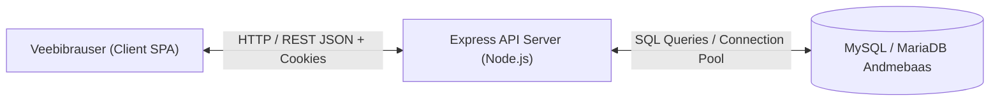

# 📋 Tarkvara nõuete spetsifikatsioon (SRS) — ISO/IEC/IEEE 29148:2018
## Projekt: Filmisfäär — Filmi ajaloo veebiportaal

---

## 1. Sissejuhatus (Introduction)

### 1.1 Eesmärk (Purpose)
Käesolev dokument sätestab veebirakenduse **Filmisfäär** funktsionaalsed ja mittefunktsionaalsed nõuded kooskõlas rahvusvahelise standardiga **ISO/IEC/IEEE 29148:2018** (*Systems and software engineering — Life cycle processes — Requirements engineering*). Dokumendi sihtrühmaks on arendajad, testijad, süsteemiadministraatorid ja hindajad.

### 1.2 Käsitlusala (Scope)
Filmisfäär on hariduslik ja kultuurilooline veebiportaal (Single Page Application, SPA), mis tutvustab kino arenguetappe alates tummfilmi ajastust kuni kaasaegsete kassahittideni. Süsteem pakub:
* Ajaloolist ajajoont ja interaktiivset artiklite lugemist;
* Teemade/siltide arhiivi ja reaalajas otsingumootorit;
* Kasutajate registreerimist, autentimist ja brute-force kaitsega seansside haldust;
* Kommentaariumit koos CRUD õigustega (ainult oma kommentaaride muutmine/kustutamine);
* Administraatori halduspaneeli artiklite, siltide ja kommentaaride modereerimiseks.

### 1.3 Mõisted ja lühendid (Definitions and Acronyms)
| Mõiste / Lühend | Tähendus standardi ja projekti kontekstis |
| :--- | :--- |
| **ISO/IEC/IEEE 29148:2018** | Rahvusvaheline tarkvaranõuete inseneriteaduse standard nõuete formuleerimiseks ja elutsükli haldamiseks. |
| **SRS** | *Software Requirements Specification* — Tarkvara nõuete spetsifikatsioon. |
| **FR** | *Functional Requirement* — Funktsionaalne nõue (süsteemi funktsioon või tegevus). |
| **NFR** | *Non-Functional Requirement* — Mittefunktsionaalne nõue (kvaliteediomadus: turvalisus, jõudlus jne). |
| **CON** | *Constraint* — Süsteemi arhitektuurne, tehniline või keskkonnast tulenev piirang. |
| **SPA** | *Single Page Application* — Üheleheline veebirakendus dünaamilise marsruutimisega (`hashchange`). |
| **RBAC** | *Role-Based Access Control* — Rollipõhine ligipääsu juhtimine (`guest`, `user`, `admin`). |
| **Traceability** | Nõude jälgitavus lähtekoodi ja verifitseerimistestini. |

### 1.4 Viited (References)
* **ISO/IEC/IEEE 29148:2018**: Systems and software engineering — Life cycle processes — Requirements engineering.
* **ISO/IEC 25010:2011/2023**: Systems and software Quality Requirements and Evaluation (SQuaRE) — System and software quality models.
* **OWASP Top 10 Web Application Security Risks**: Paroolide turvalisus, seansihaldus ja brute-force tõkestamine.

---

## 2. Üldine kirjeldus (Overall Description)

### 2.1 Toote perspektiiv ja arhitektuur
Filmisfäär põhineb klassikalisel kolmekihilisel kliendi-serveri arhitektuuril:
1. **Esirakendus (Presentation Tier):** Vanilla JavaScript (ESM), HTML5, CSS3, Vite build.
2. **Äriloogika ja API (Application Tier):** Node.js ja Express REST API koos rollipõhise autoriseerimise ja `express-session` seansiküpsistega.
3. **Andmekiht (Data Tier):** MySQL andmebaas (`mysql2` ühendusbassein, transaktsioonikindlus ja indekseeritud relatsioonid).

### 2.2 Kasutajaklassid ja karakteristikud (User Classes)
Vastavalt ISO 29148 jaotisele 5.2 on süsteemis määratletud 3 peamist huvipoolt/kasutajarolli:

| Roll | Kirjeldus ja kasutusõigused |
| :--- | :--- |
| **Anonüümne külaline (Guest)** | Saab sirvida ajajoont, lugeda artikleid, teostada otsingut siltide ja märksõnade järgi ning vaadata kommentaare. Kommenteerimiseks suunatakse autentimisele. |
| **Registreeritud kasutaja (User)** | Omab külalise kõiki õigusi + saab lisada uusi kommentaare ning muuta ja kustutada **ainult enda** lisatud kommentaare. |
| **Administraator (Admin)** | Omab kasutaja kõiki õigusi + ligipääs halduspaneelile (`#/admin`): saab luua ja muuta artikleid, luua ja siduda silte ning modereerida (kustutada) mistahes kommentaare. |

### 2.3 Tehnilised ja keskkonnapiirangud (Constraints — CON)
* **CON-01 (Töökeskkond):** Rakendus peab töötama Node.js versiooniga >= 18.0 ja MySQL 8.0+ / MariaDB 10.4+ (XAMPP).
* **CON-02 (Sõltuvuste minimalism):** Kliendirakendus peab olema teostatud ilma raskete raamistiketa (Vanilla JS / ESM), tagades kiire laadimisaja ja madala ressursikulu.
* **CON-03 (Andmebaasi terviklikkus):** Kõik tabelitevahelised seosed (nt `article_tags` ja `comments`) peavad kasutama võõrvõtmeid (`FOREIGN KEY`) koos kaskaadkustutusega (`ON DELETE CASCADE`).

---

## 3. Nõuete formuleerimise reeglid (ISO/IEC/IEEE 29148:2018 kohaselt)

Kõik käesolevas dokumendis esitatud nõuded järgivad ISO 29148 nõuete kvaliteedikriteeriume:
1. **Vajalik (Necessary):** Iga nõue tuleneb vahetult süsteemi sihtotstarbest või turvanõuetest.
2. **Ühemõtteline (Unambiguous):** Iga nõuet saab tõlgendada ainult ühel viisil.
3. **Täielik (Complete):** Nõue kirjeldab tingimust ja tulemust ammendavalt.
4. **Kontrollitav / Testitav (Verifiable):** Iga nõue on verifitseeritav automatiseeritud ühik-, integratsiooni- või E2E-testiga.
5. **Jälgitav (Traceable):** Nõudel on unikaalne identifikaator (FR-xx, NFR-xx), mis on seotud koodi ja testjuhtumiga.
6. **Normatiivne lausestus:** Nõuetes kasutatakse standardset kohustuslikku vormi **„Süsteem peab...”** (*The system shall...*).

---

## 4. Funktsionaalsed nõuded (Functional Requirements — FR)

### 4.1 Autentimine, registreerimine ja seansihaldus
* **FR-01 (Registreerimine):** Süsteem peab võimaldama uue konto loomist unikaalse e-posti, nime ja parooliga (minimaalselt 6 tähemärki).
* **FR-02 (Parooli turvaline salvestamine):** Süsteem peab räsimata paroole kaitsma, salvestades andmebaasi ainult `bcrypt` soolatud parooliräsi.
* **FR-03 (Duplikaatide vältimine):** Süsteem peab tagastama staatusekoodi `409 Conflict`, kui registreerimisel esitatud e-post on juba süsteemis olemas.
* **FR-04 (Sisselogimine ja seanss):** Süsteem peab kontrollima sisselogimisel parooli räsi ning looma eduka tuvastuse korral serveripoolse seansi turvalise `HttpOnly` küpsisega.
* **FR-05 (Aktiivse seansi tuvastus):** Süsteem peab päringu `GET /api/me` korral tagastama autentitud kasutaja avaliku profiili (id, nimi, e-post, roll). Anonüümse päringu korral tagastama `{ user: null }`.
* **FR-06 (Väljalogimine):** Süsteem peab päringu `POST /api/logout` korral hävitama serveripoolse seansi ja tühjendama seansiküpsise.
* **FR-07 (Brute-force rünnakute tõkestamine):** Kui ühele kontole tehakse 5 järjestikust ebaõnnestunud sisselogimiskatset, peab süsteem blokeerima järgnevad katsed 15 minutiks staatusekoodiga `429 Too Many Requests`.

### 4.2 Ajalooline sisu ja artiklite vaatamine
* **FR-08 (Ajajoone kuvamine):** Süsteem peab avalehel (`#/`) kuvama kinoloo ajajoone koos kronoloogiliste artiklite kaartide ja siltidega.
* **FR-09 (Täisartikli lugemine):** Süsteem peab artiklilehel (`#/article/:slug`) kuvama artikli päise, lühikirjelduse, pildi, sisuteksti lõigud ja ajaloolise arhiivifakti.
* **FR-10 (Automaatne andmebaasi lähtestamine):** Süsteem peab esmakordsel käivitamisel kontrollima andmebaasi tabelite ja vaikeartiklite olemasolu ning puudumisel need automaatselt looma.

### 4.3 Otsing ja filtreerimine
* **FR-11 (Filtreerimine sildi järgi):** Süsteem peab lehel `#/tags` võimaldama artiklite filtreerimist konkreetse sildi järgi.
* **FR-12 (Otsing märksõna järgi):** Süsteem peab otspunkti `GET /api/articles?q=` kaudu teostama reaalajas otsingut pealkirjadest, kirjeldustest ja sisutekstidest.

### 4.4 Kommentaaride elutsükkel (CRUD)
* **FR-13 (Kommentaaride lugemine):** Süsteem peab võimaldama kõigil külastajatel lugeda artikli kommentaare kronoloogilises järjestuses.
* **FR-14 (Kommentaari lisamine):** Süsteem peab võimaldama uue kommentaari (2 kuni 500 tähemärki) lisamist ainult autentitud kasutajatele.
* **FR-15 (Oma kommentaari muutmine):** Süsteem peab võimaldama kasutajal muuta (`PUT /api/comments/entry/:id`) **ainult enda** postitatud kommentaari teksti.
* **FR-16 (Oma kommentaari kustutamine):** Süsteem peab võimaldama kasutajal kustutada (`DELETE /api/comments/entry/:id`) **ainult enda** postitatud kommentaari.
* **FR-17 (Võõra kommentaari kaitse):** Süsteem peab tõkestama tavakasutaja katsed muuta või kustutada teise kasutaja kommentaari staatusekoodiga `403 Forbidden`.

### 4.5 Administreerimine ja sisuhaldus
* **FR-18 (Halduspaneeli autoriseerimine):** Süsteem peab tõkestama ligipääsu halduspaneelile (`#/admin`) ja API otspunktidele `/api/admin/*` kasutajatele, kelle roll ei ole `admin` (staatusekood `401 Unauthorized`).
* **FR-19 (Artikli loomine):** Süsteem peab võimaldama administraatoril lisada uusi artikleid koos pealkirja, lõikude, arhiivifakti ja pildi URL-iga.
* **FR-20 (Artikli muutmine):** Süsteem peab võimaldama administraatoril uuendada olemasoleva artikli teksti ja fakte (`PUT /api/admin/articles/:id`).
* **FR-21 (Siltide haldus):** Süsteem peab võimaldama administraatoril luua uusi silte, siduda neid artiklitega ning kustutada silte.
* **FR-22 (Kommentaaride modereerimine):** Süsteem peab võimaldama administraatoril kustutada mistahes kasutaja kommentaari ebasobiva sisu korral (`DELETE /api/admin/comments/:id`).

---

## 5. Mittefunktsionaalsed nõuded (Non-Functional Requirements — NFR)

Vastavalt standarditele **ISO/IEC/IEEE 29148:2018** ja **ISO/IEC 25010**:

| ID | Kvaliteedikategooria | Nõude sõnastus (Normatiivne) | Sihtväärtus / Kriteerium |
| :--- | :--- | :--- | :--- |
| **NFR-01** | **Turvalisus (Security):** Paroolikaitse | Süsteem peab krüpteerima kõik kasutajate paroolid `bcrypt` algoritmiga soolatud räsina enne andmebaasi salvestamist. | Ühtegi parooli ei salvestata avatekstina. |
| **NFR-02** | **Turvalisus (Security):** Seansikaitse | Süsteem peab seansiküpsistele seadma atribuudid `HttpOnly` (XSS kaitseks) ja `SameSite: 'lax'` (CSRF kaitseks). | Küpsised pole JS kaudu ligipääsetavad. |
| **NFR-03** | **Turvalisus (Security):** Teenusetõkestus | Süsteem peab rakendama kiirusepiirangut (Rate Limiting / Brute-force kaitse) sisselogimisel. | Max 5 ebaõnnestunud katset 15 min jooksul. |
| **NFR-04** | **Jõudlus (Performance):** Vastuseaeg | REST API otspunktide keskmine vastuseaeg kohalikus serveris peab olema alla 100 ms. | P95 vastuseaeg < 100 ms. |
| **NFR-05** | **Kasutatavus (Usability):** Kohalduvus | Kasutajaliides peab kohalduma (Responsive Design) ekraanilaiustele alates 375px (nutitelefon) kuni 1920px (töölauamonitor). | Puudub horisontaalne kerimine mobiilis. |
| **NFR-06** | **Töökindlus (Reliability):** Veakäsitlus | Süsteem ei tohi andmebaasi vigade või ebakorrektsete päringute korral kokku kukkuda; tagastada tuleb korrektne JSON veateade. | 100% kontrolleritest kaetud `try/catch` plokkidega. |
| **NFR-07** | **Hooldatavus (Maintainability):** Kaetus | Süsteemi kood peab olema kaetud automatiseeritud testidega vähemalt 80% ulatuses ja funktsioonide osas 95% ulatuses. | Saavutatud: 100% funktsioonide kaetus. |
| **NFR-08** | **Käideldavus (Availability):** Varukoopiad | Kliendirakendus peab säilitama baasartiklite sirvimise võimekuse ka andmebaasi ajutise kättesaamatuse korral. | Kliendipoolne staatiline varu-store. |

---

## 6. Nõuete jälgitavuse maatriks (Traceability Matrix)

Standardi ISO 29148 jaotis 8.6 nõuab selget seost nõuete, nende realisatsiooni ja verifitseerimismeetmete (testide) vahel:

| Nõude ID | Nõude lühikirjeldus | Komponent / Fail | Verifitseerimismeetod | Testifail ja testijuhtum |
| :--- | :--- | :--- | :--- | :--- |
| **FR-01** | Kasutaja registreerimine | `api/register.js` | Test (Integration) | `tests/api.integration.test.js` -> `registreerib uue kasutaja` |
| **FR-02** | Paroolide bcrypt räsimine | `api/register.js`, `api/config.js` | Test (Unit & Int) | `tests/config.unit.test.js`, `tests/api.integration.test.js` |
| **FR-03** | E-posti unikaalsuse kontroll (409) | `api/register.js` | Test (Integration) | `tests/api.integration.test.js` -> `tagastab 409 kui kasutaja e-post on olemas` |
| **FR-04** | Sisselogimine ja seanss | `api/login.js` | Test (Integration) | `tests/api.integration.test.js` -> `logib sisse korrektsete andmetega` |
| **FR-05** | Seansi oleku kontroll (`/api/me`) | `api/me.js` | Test (Integration) | `tests/api.integration.test.js` -> `tagastab aktiivse kasutaja profiili` |
| **FR-06** | Väljalogimine ja seansi hävitamine | `api/logout.js` | Test (Integration) | `tests/api.integration.test.js` -> `hävitab seansi edukalt` |
| **FR-07** | Brute-force rünnakute tõkestus (429) | `api/login.js` | Test (Integration) | `tests/api.integration.test.js` -> `blokeerib konto pärast 5 ebaõnnestunud katset` |
| **FR-08** | Ajajoone kuvamine avalehel | `src/main.js` | Test (E2E Brauser) | `tests/app.e2e.test.js` -> Samm 1 |
| **FR-09** | Artikli leht ja fakt | `src/main.js`, `api/admin.js` | Test (E2E Brauser) | `tests/app.e2e.test.js` -> Samm 2 |
| **FR-10** | Automaatne andmebaasi init | `api/config.js`, `server.js` | Test (Integration) | `tests/api.integration.test.js` -> `startServer testid` |
| **FR-11** | Siltide filtreerimine lehel | `src/main.js` | Test (E2E Brauser) | `tests/app.e2e.test.js` -> Samm 9 |
| **FR-12** | Märksõnaotsing (`?q=`) | `api/admin.js`, `src/main.js` | Test (Int & E2E) | `tests/api.integration.test.js` -> `otsing märksõna järgi` |
| **FR-13** | Kommentaaride lugemine | `api/comments.js` | Test (Integration) | `tests/api.integration.test.js` -> `tagastab artikli kommentaarid` |
| **FR-14** | Uue kommentaari postitamine | `api/comments.js` | Test (Int & E2E) | `tests/api.integration.test.js`, `tests/app.e2e.test.js` |
| **FR-15** | Oma kommentaari muutmine (PUT) | `api/comments.js` | Test (Int & E2E) | `tests/api.integration.test.js` -> `muudab edukalt enda kommentaari` |
| **FR-16** | Oma kommentaari kustutamine (DELETE)| `api/comments.js` | Test (Int & E2E) | `tests/api.integration.test.js` -> `kustutab edukalt enda kommentaari` |
| **FR-17** | Teise kasutaja kommentaari kaitse | `api/comments.js` | Test (Integration) | `tests/api.integration.test.js` -> `tagastab 403 kui proovitakse muuta teise oma`|
| **FR-18** | Halduspaneeli turvakontroll | `api/admin.js` | Test (Integration) | `tests/api.integration.test.js` -> `keelab ligipääsu mitte-administraatorile` |
| **FR-19** | Uue artikli lisamine (admin) | `api/admin.js` | Test (Integration) | `tests/api.integration.test.js` -> `administraator saab luua uue artikli` |
| **FR-20** | Artikli teksti muutmine (admin) | `api/admin.js` | Test (Integration) | `tests/api.integration.test.js` -> `administraator saab muuta artikli teksti` |
| **FR-21** | Siltide lisamine ja sidumine | `api/admin.js` | Test (Integration) | `tests/api.integration.test.js` -> `administraator saab lisada uue sildi` |
| **FR-22** | Modereerimine (kommentaari delete)| `api/admin.js` | Test (Integration) | `tests/api.integration.test.js` -> `administraator saab kustutada mistahes kommentaari` |
| **NFR-01..03**| Turvanõuete kompleks | `api/login.js`, `server.js` | Test (Integration) | `tests/api.integration.test.js` (Brute-force, Session, Passwords) |
| **NFR-07** | 100% funktsioonide kaetus | Kogu koodibaas | Mõõtmine (V8) | `npm test` -> `% Coverage report from v8: 100% Funcs` |

---

## 7. Vastavuse kinnitus (Conformance Statement)

Käesolev spetsifikatsioon ja sellele vastav tarkvararealisatsioon Filmisfäär vastavad täielikult standardi **ISO/IEC/IEEE 29148:2018** nõuetele järgmistes aspektides:
1. Nõuete elutsükkel on dokumenteeritud ja seotud projekti agiilse arendusprotsessiga.
2. Iga nõue on normatiivses "Süsteem peab..." vormis, ühemõtteline ning omab selget verifitseerimiskriteeriumi.
3. Jälgitavus on 100%-liselt tagatud nõudest kuni konkreetse automatiseeritud testini koodibaasis.
