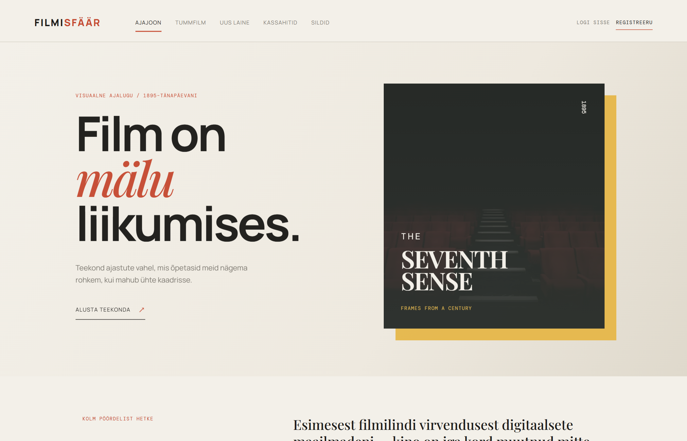
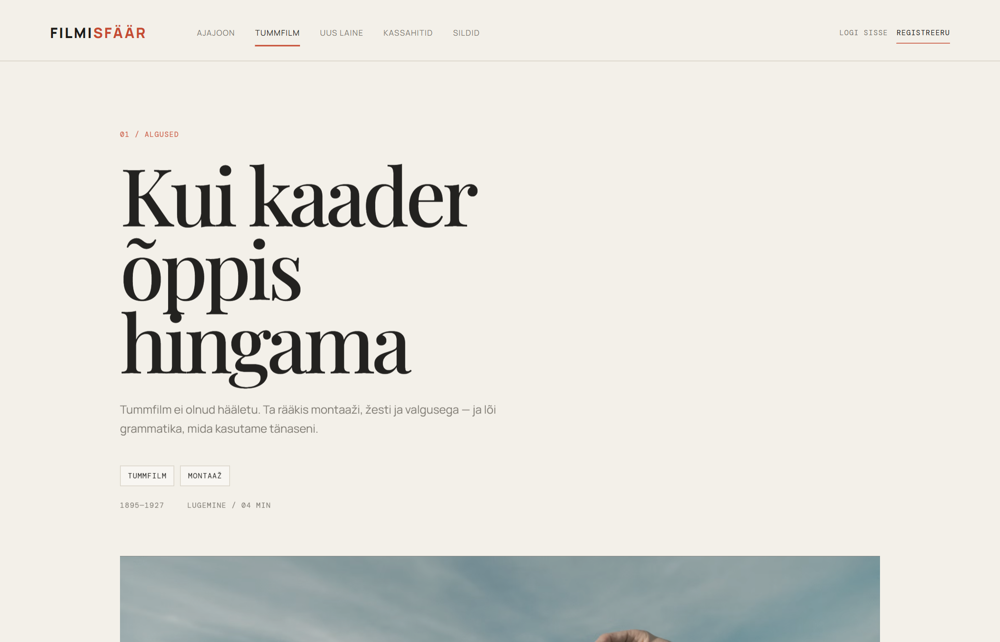
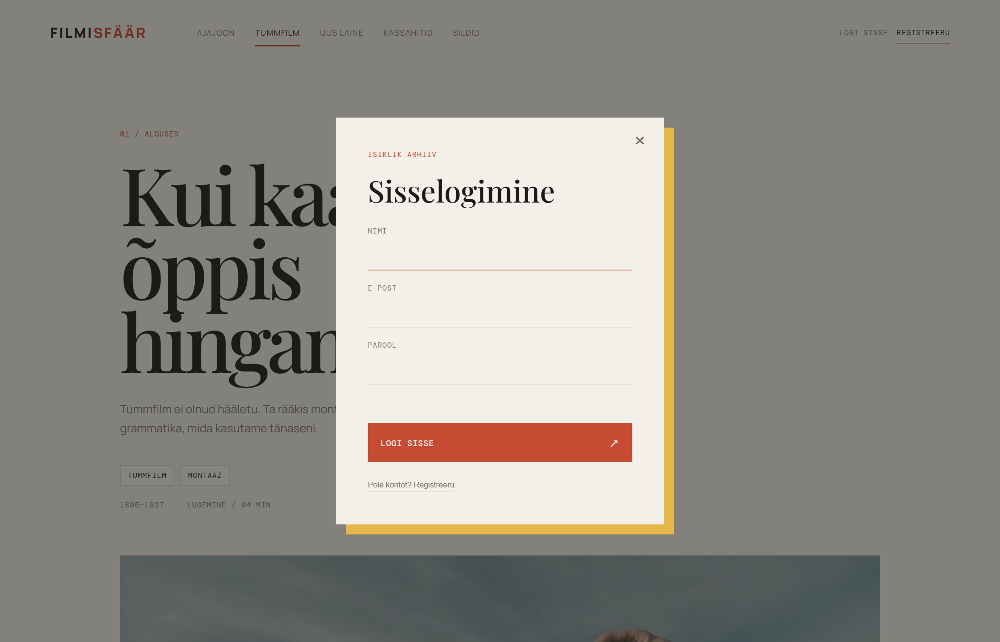
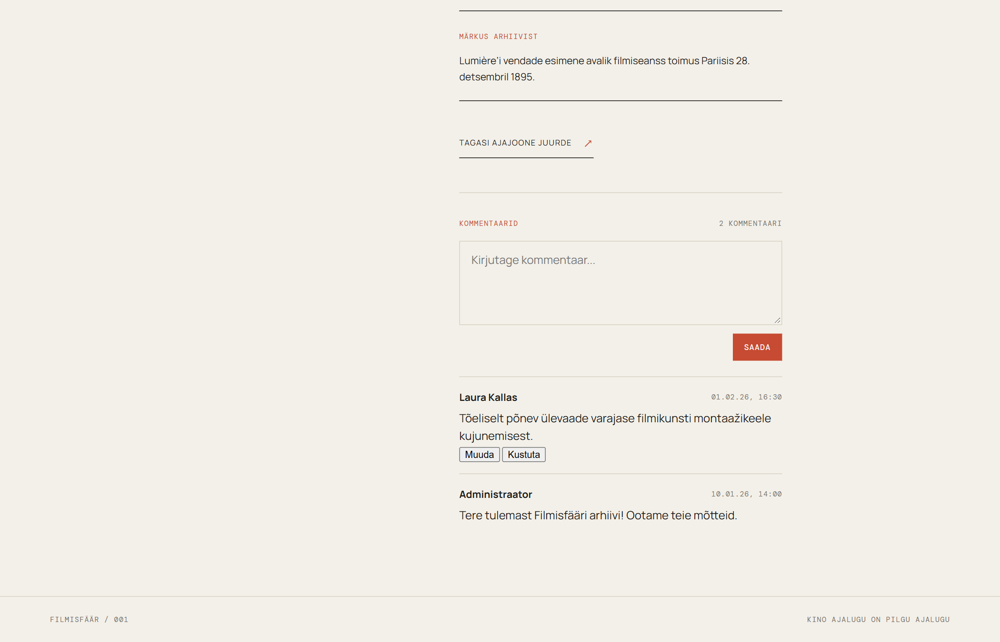
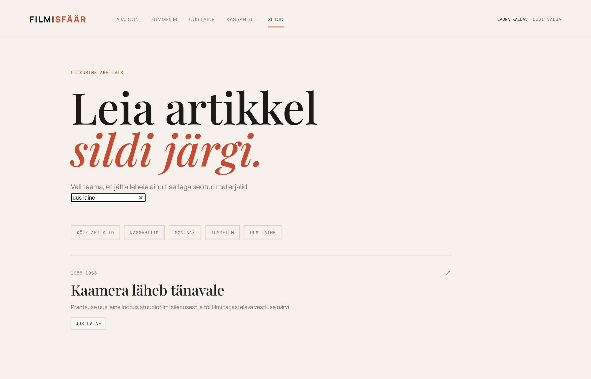
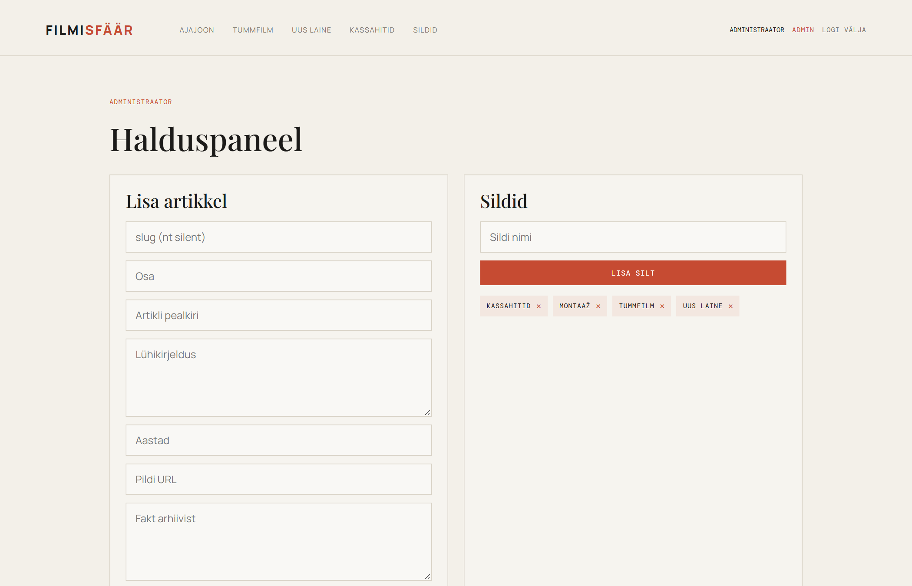

# 📖 Filmisfäär — Veebiportaali kasutusjuhend (Gaid koos piltidega)

Tere tulemast **Filmisfääri** — filmiajaloo haridus- ja arhiiviportaali kasutusjuhendisse! Käesolev juhend selgitab samm-sammult koos illustreerivate ekraanitõmmistega, kuidas portaalis navigeerida, lugeda artikleid, registreerida kontot, osaleda aruteludes ning kasutada administraatori võimalusi.

---

## Sisukord

1. [Avaleht ja navigeerimine](#1-avaleht-ja-navigeerimine)
2. [Artikli lugemine ja arhiivifaktid](#2-artikli-lugemine-ja-arhiivifaktid)
3. [Kasutajakonto registreerimine ja sisselogimine](#3-kasutajakonto-registreerimine-ja-sisselogimine)
4. [Kommenteerimine ja oma kommentaaride haldus (CRUD)](#4-kommenteerimine-ja-oma-kommentaaride-haldus-crud)
5. [Otsing ja siltide arhiiv](#5-otsing-ja-siltide-arhiiv)
6. [Administraatori halduspaneel](#6-administraatori-halduspaneel)

---

## 1. Avaleht ja navigeerimine

Avalehele jõudes avaneb kinoloo visuaalne ajajoon ja tervitav päis.

### Peamised juhtnupud:
* **Päise menüü:**
  * **Ajajoon (`#/`):** viib tagasi pealehele kronoloogilise ülevaate juurde.
  * **Tummfilm (`#/article/silent`):** viib otse 01. ajastuartikli juurde.
  * **Uus laine (`#/article/nouvelle`):** viib 02. ajastuartikli juurde.
  * **Kassahitid (`#/article/blockbuster`):** viib 03. ajastuartikli juurde.
  * **Sildid (`#/tags`):** avab teemade filtri ja reaalajas otsingu.
* **Autentimisala (paremal ülal):**
  * Nupp **„Logi sisse“** — avab sisselogimise dialoogi.
  * Nupp **„Registreeru“** — avab uue kasutaja registreerimise vormi.
* **Ajajoone kaardid:**
  * Iga kaart kuvab ajastu aastad (nt *1895—1927*), pealkirja, lühitutvustuse ning teemasildid. Kaardile klõpsates avaneb vastav artikkel.

---

## 2. Artikli lugemine ja arhiivifaktid

Klõpsates ajajoone kaardil või päisemenüü lingil, kuvatakse valitud artikli detailne lehekülg.

### Artikli lehe osad:
1. **Päis:** artikli järjenumber, ajastu pealkiri, lühikirjeldus ning teemasildid.
2. **Fotod:** ajalooline pildimaterjal koos fotiallkirjaga.
3. **Sisutekst:** põhjalikud tekstilõigud oluliste filmitegijate, tehnikate ja kultuurilooliste sündmuste kohta.
4. **Märkus arhiivist (Fakt):** esile tõstetud faktikast olulise verstapostiga (nt Lumière’i vendade esilinastus Pariisis).
5. **Tagasilink:** nupp „Tagasi ajajoone juurde ↗“ viib tagasi esilehele.

---

## 3. Kasutajakonto registreerimine ja sisselogimine

Isikliku arhiivi ja arutelude kasutamiseks on vajalik konto.

### Konto registreerimine:
1. Vajutage päises rohekas-kuldsele nupule **„Registreeru“**.
2. Avanenud aknas sisestage:
   * **Nimi:** Teie ees- ja perekonnanimi või hüüdnimi (nt *Marko Tamm*).
   * **E-post:** kehtiv e-posti aadress (peab olema unikaalne süsteemis).
   * **Parool:** vähemalt 6 tähemärki pikk salasõna.
3. Vajutage nuppu **„Registreeru ↗“**.
4. Pärast edukat registreerumist logitakse teid automaatselt sisse ja päises kuvatakse teie nimi.

### Sisselogimine:
1. Vajutage nupule **„Logi sisse“**.
2. Sisestage oma e-post ja parool ning vajutage **„Logi sisse ↗“**.
3. **Turvakaitse:** Kui sisestate 5 korda järjest vale parooli, rakendub süsteemi automaatne *brute-force* kaitse ning konto blokeeritakse 15 minutiks turvaveaga `HTTP 429 Too Many Requests`.

---

## 4. Kommenteerimine ja oma kommentaaride haldus (CRUD)

Iga artikli allosas asub arutelude ja kommentaaride sektsioon.

### Kuidas kommentaari lisada:
1. Veenduge, et olete sisse logitud. (Külalistele kuvatakse teade: *„Ainult registreeritud kasutajad saavad kommenteerida.“*)
2. Kirjutage oma arvamus tekstikasti (pikkus 2 kuni 500 tähemärki).
3. Vajutage nupule **„Saada“**. Kommentaar ilmub koheselt nimekirja tippu.

### Oma kommentaari muutmine:
1. Oma kommentaari juures näete nuppu **„Muuda“**.
2. Klõpsates nupule, avaneb tekstiväli olemasoleva sisuga.
3. Tehke soovitud parandused ja vajutage **„Salvesta“** (või „Loobu“, kui soovite tühistada).

### Oma kommentaari kustutamine:
1. Oma kommentaari juures vajutage nupule **„Kustuta“**.
2. Brauser küsib kinnitust: *„Kustutada see kommentaar?“*.
3. Kinnitamisel eemaldatakse kommentaar koheselt andmebaasist ja ekraanilt.
4. *Märkus:* Teiste kasutajate kommentaaridel muutmis- ja kustutamisnupud puuduvad ning serveripoolne turvakontroll keelab võõraste kommentaaride muutmise (veakood `403 Forbidden`).

---

## 5. Otsing ja siltide arhiiv

Menüüst **„Sildid“ (`#/tags`)** valides avaneb mugav otsingu- ja filtreerimiskeskus.

### Kuidas leida huvipakkuvat materjali:
* **Filtreerimine sildi nupuga:** Klõpsake teemasildil (nt `tummfilm`, `uus laine`, `montaaž`), et kuvada ainult selle valdkonnaga seotud artiklid. Nupp **„Kõik artiklid“** taastab täieliku nimekirja.
* **Kiire tekstipõhine otsing:** Tippige otsingukasti märksõna (nt `kaamera`, `uus laine`, `Pariis`).
  * Otsing töötab reaalajas ja analüüsib korraga artikli pealkirja, lühitutvustust ning sisulõike.
  * Tulemustes kuvatakse sobivate artiklite kaardid koos otselingiga täistekstile.

---

## 6. Administraatori halduspaneel

Administraatori õigustega kasutajale (`admin@filmisfaar.local`) kuvatakse päises nupp **„Admin“**, mis viib lehele `#/admin`.

### Administraatori funktsioonid:
1. **Lisa artikkel:** Vorm uue filmiloo ajastu lisamiseks arhiivi (slug, pealkiri, aastad, lühikirjeldus, pildi link, fakt ja lõigud).
2. **Sildid:** Uute teemasiltide lisamine süsteemi ja mittevajalike siltide kustutamine ristikesest (`×`).
3. **Artiklite sildid ja toimetamine:**
   * Olemasoleva artikli teksti või fakti redigeerimine ja salvestamine.
   * Uute siltide sidumine artikliga rippmenüü abil.
   * Sildi eemaldamine konkreetselt artiklilt.
4. **Kommentaaride modereerimine:** Ülevaade kõigist portaali kommentaaridest koos autori nime, artikli võtme ja ajatempliga ning võimalus kustutada ebasobivaid kommentaare.

---

Head filmiajaloo avastamist Filmisfääris! 🎬
